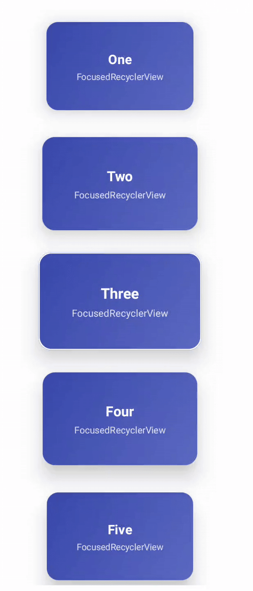
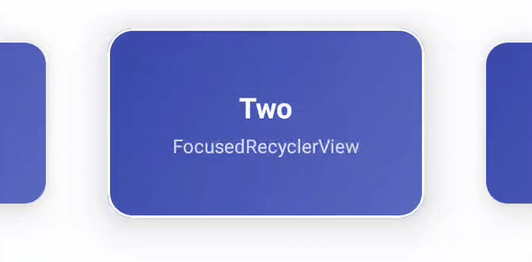

## FocusedRecyclerView
[](https://kotlinlang.org/)
[](LICENSE)
[](#)
---

A lightweight, Kotlin-first Android library that provides a focused, center-snapping RecyclerView with smooth scale/elevation effects — ideal for carousels, TV-style UIs, and modern scrolling experiences.

---

### Features

- Center item detection
- Smooth scale & elevation focus effect
- Perfect center snapping (custom SnapHelper)
- Horizontal and Vertical orientation support
- Focus callback only when focus changes (no spam)
- Optional focused view callback for custom UI
- Works with any RecyclerView.Adapter

---

### Preview

<p align="center">
<table>
  <tr>
    <td align="center">
      
    </td>
    <td align="center">
      
    </td>
  </tr>
</table>
</p>

---

## Installation (JitPack)

### 1️⃣ Add JitPack to your **root `settings.gradle` or `build.gradle`**

```gradle
dependencyResolutionManagement {
    repositories {
        google()
        mavenCentral()
        maven { url 'https://jitpack.io' }
    }
}
```
### Add Dependency
```
dependencies {
	        implementation 'com.github.Excelsior-Technologies-Community:Android_FocusedRecyclerView:1.0.0'
	}
```

---

### Basic Usage

XML
```xml
<com.ext.focusedrecyclerview.FocusedRecyclerView
    android:id="@+id/focusedRecycler"
    android:layout_width="match_parent"
    android:layout_height="300dp"
    android:clipToPadding="false"
    android:paddingStart="48dp"
    android:paddingEnd="48dp"
    app:frv_scaleFactor="0.25"
    app:frv_minScale="0.85"
    app:frv_elevation="16dp"/>
```

Kotlin
```kotlin
val recycler = findViewById<FocusedRecyclerView>(R.id.focusedRecycler)

recycler.layoutManager =
    LinearLayoutManager(this, RecyclerView.HORIZONTAL, false)

recycler.adapter = MyAdapter(items)

recycler.setOnItemFocusListener { position ->
    Log.d("FocusedRecycler", "Focused item: $position")
}
```

Vertical Support
```kotlin
recycler.layoutManager =
    LinearLayoutManager(this, RecyclerView.VERTICAL, false)
```

**Custom Focused View UI (Advanced)**

If you want to customize the focused item view (highlight, badge, animation, overlay):
```kotlin
recycler.setOnItemFocusViewListener { view, position, isFocused ->

    val card = view as? MaterialCardView ?: return@setOnItemFocusViewListener

    if (isFocused) {
        card.strokeWidth = 3
        card.strokeColor = getColor(R.color.white)
    } else {
        card.strokeWidth = 0
    }
}
```

---

### XML Attributes

| Attribute          | Description                               | Default |
|-------------------|-------------------------------------------|---------|
| `frv_scaleFactor` | Scale intensity based on distance          | `0.15`  |
| `frv_minScale`    | Minimum scale for side items               | `0.85`  |
| `frv_elevation`   | Elevation applied to the focused item      | `12dp`  |

---

### License

```
MIT License

Copyright (c) 2025 Excelsior Technologies 

Permission is hereby granted, free of charge, to any person obtaining a copy
of this software and associated documentation files (the "Software"), to deal
in the Software without restriction, including without limitation the rights
to use, copy, modify, merge, publish, distribute, sublicense, and/or sell
copies of the Software, and to permit persons to whom the Software is
furnished to do so, subject to the following conditions:

The above copyright notice and this permission notice shall be included in all
copies or substantial portions of the Software.

THE SOFTWARE IS PROVIDED "AS IS", WITHOUT WARRANTY OF ANY KIND, EXPRESS OR
IMPLIED, INCLUDING BUT NOT LIMITED TO THE WARRANTIES OF MERCHANTABILITY,
FITNESS FOR A PARTICULAR PURPOSE AND NONINFRINGEMENT. IN NO EVENT SHALL THE
AUTHORS OR COPYRIGHT HOLDERS BE LIABLE FOR ANY CLAIM, DAMAGES OR OTHER
LIABILITY, WHETHER IN AN ACTION OF CONTRACT, TORT OR OTHERWISE, ARISING FROM,
OUT OF OR IN CONNECTION WITH THE SOFTWARE OR THE USE OR OTHER DEALINGS IN THE
SOFTWARE.
```


